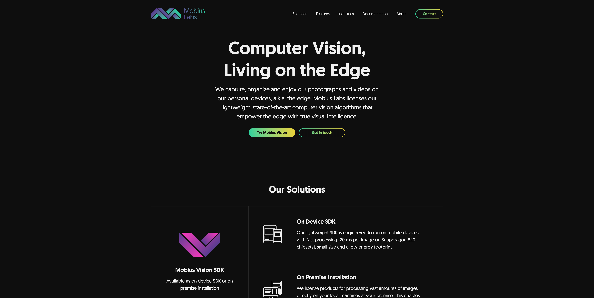
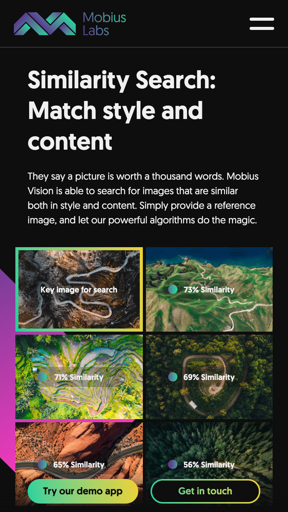

<!-- AUTO-GENERATED-CONTENT:START (STARTER) -->
<h1 align="center">
    复刻网站 mobius.ml
</h1>
    

 [mobius.ml](https://mobius.ml/) 这个网站的配色与交互效果都非常棒
 
 ## 技术栈
    Gatsbyjs
    graphql
    
## 🚀 二次开发指南

1.  **Start developing.**

    ```sh
    cd project/
    gatsby develop
    ```

2. 截图预览
    - PC 
    
    
    - Mobile 
    

3. 在线预览地址
    
    [https://5d5178665ef81600086834d8--sleepy-swanson-8da2fc.netlify.com/](https://5d5178665ef81600086834d8--sleepy-swanson-8da2fc.netlify.com/)
